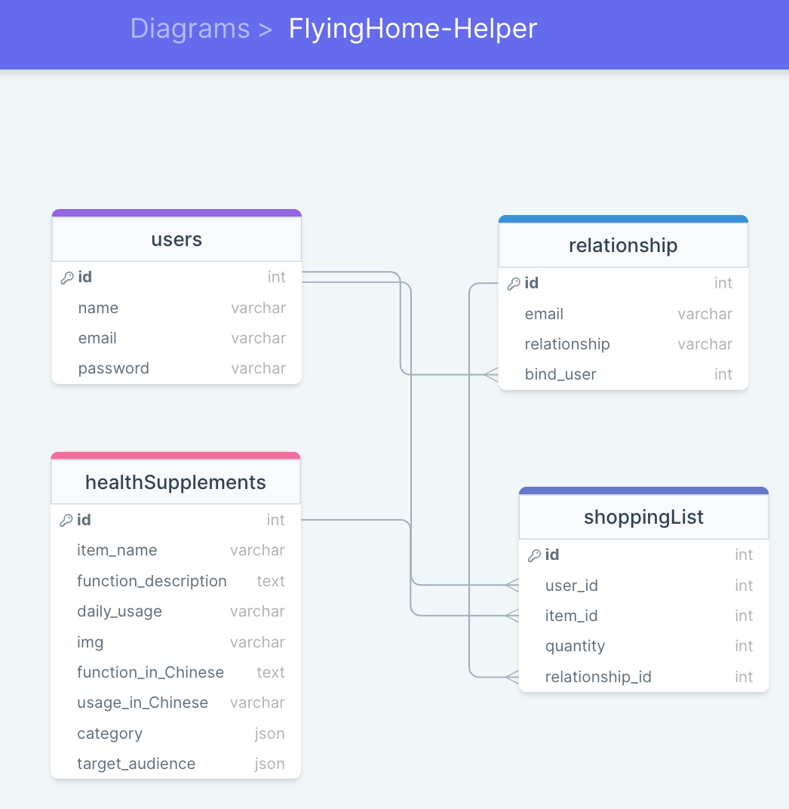

# Project Title
Flyinghome Helper

## Overview

For new immigrants, when flying home, it can help them take gifts (health supplements) for relatevies in home country.
 
### Problem

For Costco health supplements, such cs Calcium, VC, etc, expect these basic ones, I don’t know the functions of them, which is good for heart, which is good for bone. Each time, if I need buy some for relatives in my home country, I researched the functions on the website for each of them. And later for a while, I forgot totally. Also, for seniors in my home country, they can’t read English when they get the health supplements and don’t know the daily usage. 

### User Profile
- my relatives can check the functions and daily usage by themselves in Chinese
- if they want me take something when I back to home country, they can send me health supplements lists directly
- I can get a total sum for each of item and buy in Costco

### Features
**user here means my relatives**
- As a user, I can see a list of health supplements (advanced: can filter by function area: heart/bone/..., also filter by senior/kid/men/women)
- As a user, I can click each item image, check the functions and daily usage
- As a user, if I click "translate into Chinese", I can check the functions and daily usage in Chinese
- As a user, I can add item into order cart
- As a user, I can send the order cart to someone(must be registered username) who help to buy and take home
**logged in user here means me/my husband**
- As a logged in user, I can check my order list (for each item, total number) which was sent by relatives
- As a logged in user, if I finished one item shopping, I can update the status to done

## Implementation

### Tech Stack

- React
- JSX
- MySQL
- Express
- Client libraries: 
    - react
    - react-router
    - axios
- Server libraries:
    - knex
    - express

### APIs

- No external APIs will be used

### Sitemap

- Home page (Health Supplements List page)
- Health Supplements Detail page
- Shopping cart page
- Register
- Login
- My List page (upper part is item name/total quantity table, lower part is relative/item name/quantity table)

### Mockups

### Data Structure

### Endpoints

**GET /healthSupplements**
**GET /healthSupplements/:id**

**POST /users/register**
**POST /users/login**

**GET /users/list**

## Roadmap

- Create client
    - react project with routes and boilerplate pages

- Create server
    - express project with routing, with placeholder 200 responses

- Create migrations

- Gather 20 sample health supplements (img, name, function, daily usage,function in Chinese, daily usage in Chinese )

- Create seeds with sample health supplements
- ......

